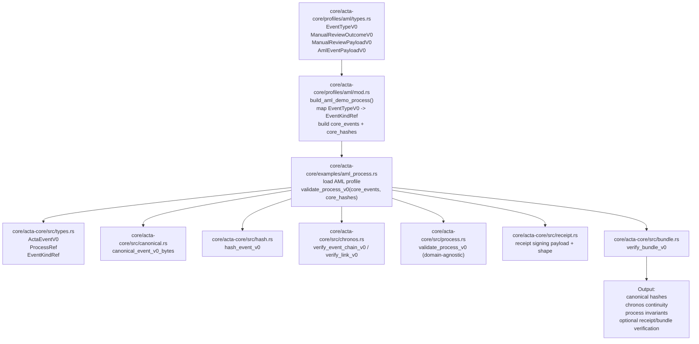

# ACTA

ACTA MVP (Cardano-native) built **protocol-first** and **sidechain-ready**.

## Repo structure
- `core/acta-core` — Rust protocol core (canonicalization, hashing, receipts, Chronos, Merkle, bundle verification)
- `modules/*` — replaceable implementations (attestation, anchoring, policy resolvers, etc.)
- `services/*` — orchestration services (API/DB/epochs/anchoring)
- `tools/verifier` — independent verifier (CLI/lib)
- `docs/spec` — frozen protocol specs (Phase 0)
- `docs/adr` — architectural decisions

## Architecture: Domain Profiles -> Core

## Branching
- `main` stable
- `develop` integration
- feature branches: `feat/*`, `fix/*`, `chore/*`
