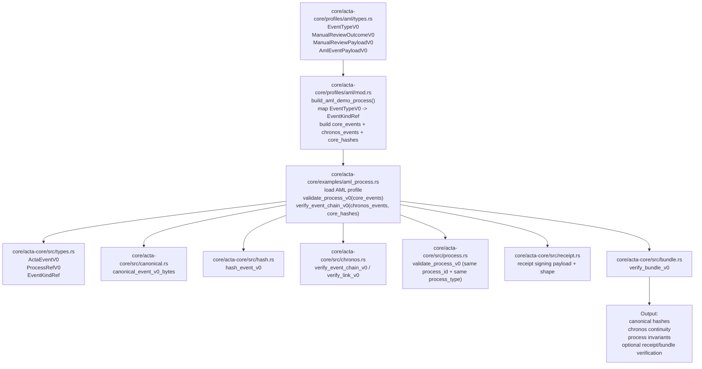

# ACTA

ACTA MVP (Cardano-native) built **protocol-first** and **sidechain-ready**.

## Repo structure
- `core/acta-core` — Rust protocol core (canonicalization, hashing, receipts, Chronos, Merkle, bundle verification)
- `modules/*` — replaceable implementations (attestation, anchoring, policy resolvers, etc.)
- `services/*` — orchestration services (API/DB/epochs/anchoring)
- `tools/verifier` — independent verifier (CLI/lib)
- `docs/spec` — frozen protocol specs (Phase 0)
- `docs/adr` — architectural decisions

## Architecture: Domain Profiles -> Core



## Example AML (core event + chronos ref)

```
{
  "event": {
    "protocol": "acta.v0",
    "event_id": "aml-case-2025-000341-ev0003",
    "issued_at": "2025-01-15T10:30:00Z",
    "process_ref": {
      "process_id": "AML-CASE-2025-000341",
      "process_type": "aml.transfer.v1"
    },
    "event_kind": {
      "namespace": "aml",
      "kind": "risk_scored",
      "version": "1.0"
    },
    "commitments": {
      "inputs_commitment": "sha256:aml_score_inputs",
      "outputs_commitment": "sha256:aml_score_outputs_with_risk_score",
      "artifact_commitment": "sha256:aml_score_artifacts"
    },
    "policy_snapshot": {
      "policy_id": "AML-2025-Q1",
      "policy_hash": "sha256:aml_2025_q1_policy_hash",
      "policy_type": "regulatory",
      "jurisdiction": "US",
      "effective_from": "2025-01-01T00:00:00Z",
      "effective_to": "2025-03-31T23:59:59Z"
    },
    "actor_ref": {
      "actor_id": "tap:AML-Sentinel-v4.5-build-2025-01-15",
      "actor_type": "service"
    }
  },
  "chronos_ref": {
    "epoch_id": "epoch-2025-01-15-001",
    "prev_event_hash": "9d5f3e4f6d6ed0f6b6a9f6f0e33c8d7a3e4f8d2f0a1b2c3d4e5f60718293a4b5"
  }
}

```

## Branching
- `main` stable
- `develop` integration
- feature branches: `feat/*`, `fix/*`, `chore/*`
